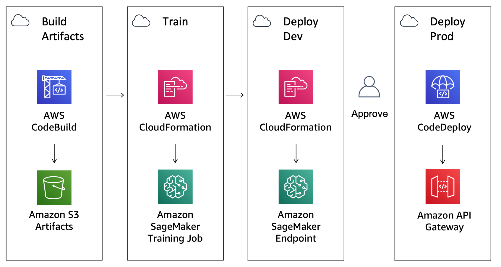
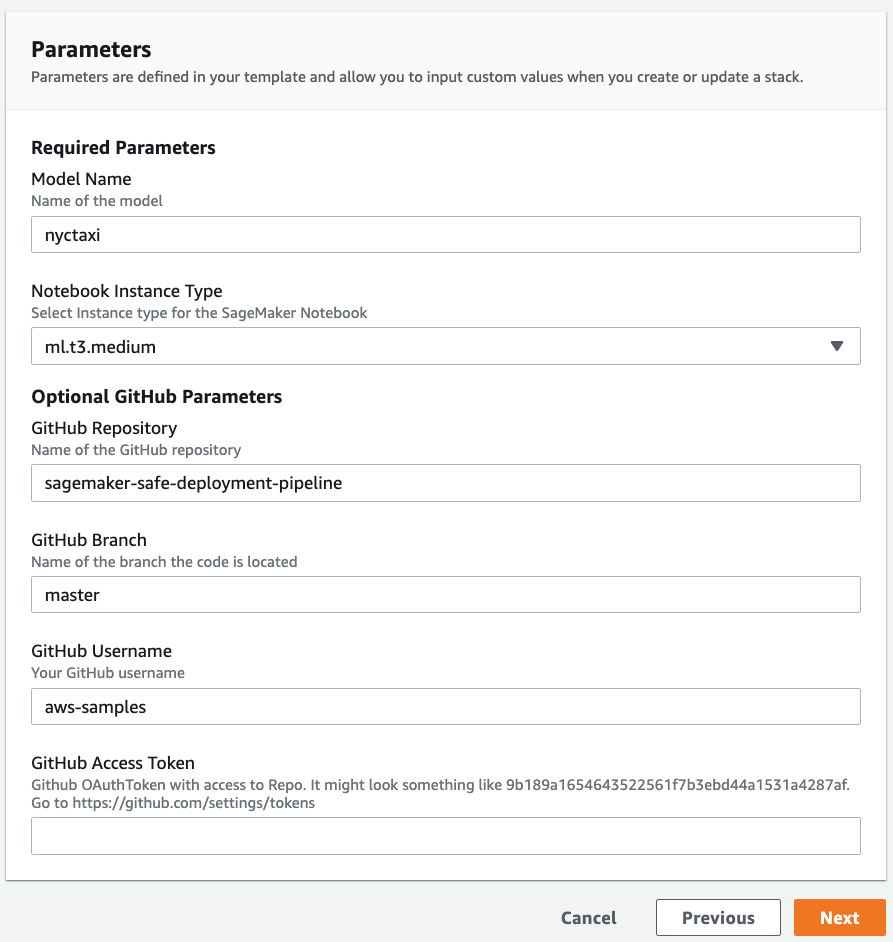
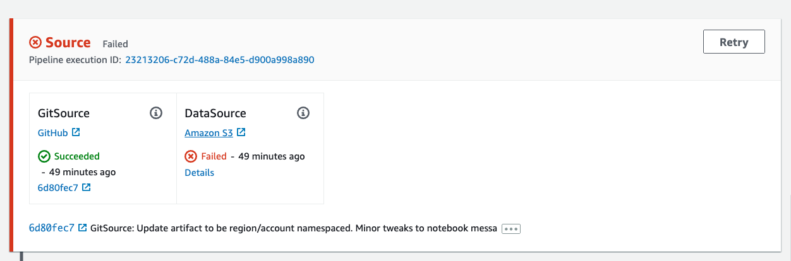
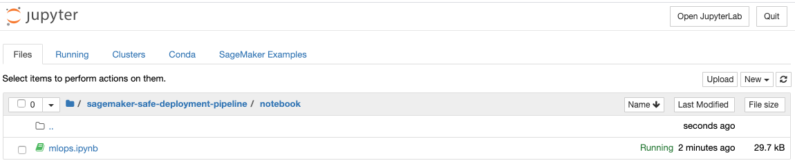
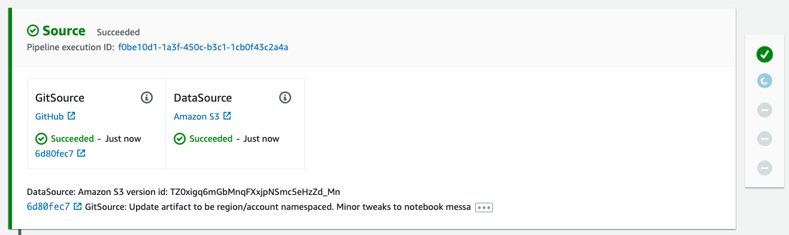
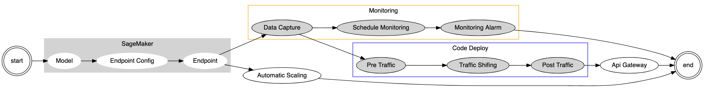
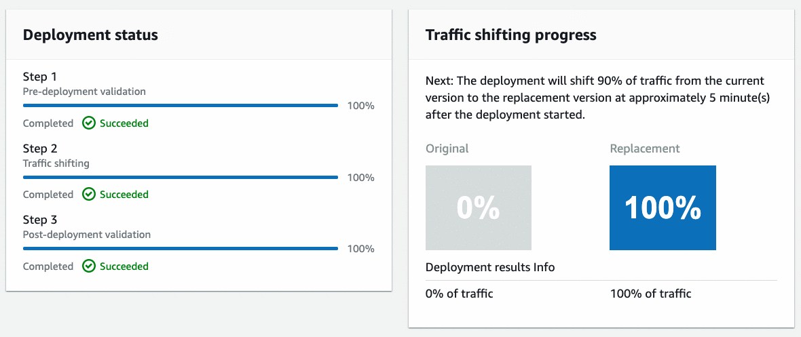

# Amazon SageMaker Safe Deployment Pipeline

## Introduction

This is a sample solution to build a safe deployment pipeline for Amazon SageMaker. This example could be useful for any organization looking to operationalize machine learning with native AWS development tools such as AWS CodePipeline, AWS CodeBuild and AWS CodeDeploy.

This solution provides a *Blue/Green*, also known as an *Canary deployment*, by creating an AWS Lambda API that calls into an Amazon SageMaker Endpoint for real-time inference.

##  Architecture

In the following diagram, you can view the continuous delivery stages of AWS CodePipeline.

1. Build Artifacts: Runs an AWS CodeBuild job to create AWS CloudFormation templates.
2. Train: Trains an Amazon SageMaker pipeline and Baseline Processing Job
3. Deploy Dev: Deploys a development Amazon SageMaker Endpoint
4. Deploy Prod: Deploys an Amazon API Gateway endpoint, and AWS Lambda function in front of Amazon SageMaker Endpoints using AWS CodeDeploy for blue/green deployment and rollback.



###  Components Details

  - [**AWS CodePipeline**](https://aws.amazon.com/codepipeline/) – CodePipeline has various stages defined in CloudFormation, which step through which actions must be taken in which order to go from source code to creation of the production endpoint.
  - [**AWS CodeBuild**](https://aws.amazon.com/codebuild/) – This solution uses AWS CodeBuild to build the source code from GitHub.
  - [**Amazon S3**](https://aws.amazon.com/s3/) – Artifacts created throughout the pipeline as well as the data for the model is stored in an Simple Storage Service (S3) Bucket.
  - [**AWS CloudFormation**](https://aws.amazon.com/cloudformation/) – This solution uses the AWS CloudFormation Template language, in either YAML or JSON, to create each resource including a custom resource.
  - [**AWS Step Functions**](https://aws.amazon.com/step-functions/) – This solutions creates AWS StepFunctions to orchestrate Amazon SageMaker training and processing jobs.
  - [**Amazon SageMaker**](https://aws.amazon.com/sagemaker/) – This solution uses Amazon SageMaker to train and deploy the machine learning model.
  - [**AWS CodeDeploy**](https://aws.amazon.com/codedeploy/) – This solution uses AWS CodeDeploy to automate shifting traffic between two AWS Lambda functions.
  - [**Amazon API Gateway**](https://aws.amazon.com/api-gateway/) – This solutions creates an HTTPS REST API endpoint for AWS Lambda functions that invoke deployed Amazon SageMaker Endpoint.

## Deployment Steps

The following is the list of steps required to get up and running with this sample.

###  Prepare an AWS Account

Create your AWS account at [http://aws.amazon.com](http://aws.amazon.com) by following the instructions on the site.

###  *Optionally* fork this GitHub Repository and create an Access Token
 
1. [Fork](https://github.com/aws-samples/sagemaker-safe-deployment-pipeline/fork) a copy of this repository into your own GitHub account by clicking the **Fork** in the upper right-hand corner.
2. Follow the steps in the [GitHub documentation](https://help.github.com/en/github/authenticating-to-github/creating-a-personal-access-token-for-the-command-line) to create a new (OAuth 2) token with the following scopes (permissions): `admin:repo_hook` and `repo`. If you already have a token with these permissions, you can use that. You can find a list of all your personal access tokens in [https://github.com/settings/tokens](https://github.com/settings/tokens).  
3. Copy the access token to your clipboard. For security reasons, after you navigate off the page, you will not be able to see the token again.  If you have lost your token, you can [regenerate](https://docs.aws.amazon.com/codepipeline/latest/userguide/GitHub-authentication.html#GitHub-rotate-personal-token-CLI) your token.

###  Launch the AWS CloudFormation Stack

Click on the **Launch Stack** button below to launch the CloudFormation Stack to set up the SageMaker safe deployment pipeline.

[](https://us-east-1.console.aws.amazon.com/cloudformation/home?region=us-east-1#/stacks/quickcreate?templateUrl=https%3A%2F%2Famazon-sagemaker-safe-deployment-pipeline.s3.amazonaws.com%2Fsfn%2Fpipeline.yml&stackName=nyctaxi&param_GitHubBranch=master&param_GitHubRepo=amazon-sagemaker-safe-deployment-pipeline&param_GitHubUser=aws-samples&param_ModelName=nyctaxi&param_NotebookInstanceType=ml.t3.medium)

Provide a stack name eg **sagemaker-safe-deployment-pipeline** and specify the parameters.

Parameters | Description
----------- | -----------
Model Name | A unique name for this model (must be less than 15 characters long).
S3 Bucket for Dataset | The bucket containing the dataset (defaults to [nyc-tlc](https://registry.opendata.aws/nyc-tlc-trip-records-pds/))
Notebook Instance Type | The [Amazon SageMaker instance type](https://aws.amazon.com/sagemaker/pricing/instance-types/). Default is ml.t3.medium.
GitHub Repository | The name (not URL) of the GitHub repository to pull from.
GitHub Branch | The name (not URL) of the GitHub repository’s branch to use.
GitHub Username | GitHub Username for this repository. Update this if you have forked the repository.
GitHub Access Token | The optional Secret OAuthToken with access to your GitHub repository.
Email Address | The optional Email address to notify on successful or failed deployments.



You can launch the same stack using the AWS CLI. Here's an example:

`
 aws cloudformation create-stack --stack-name sagemaker-safe-deployment \
   --template-body file://pipeline.yml \
   --capabilities CAPABILITY_IAM \
   --parameters \
       ParameterKey=ModelName,ParameterValue=mymodelname \
       ParameterKey=GitHubUser,ParameterValue=youremailaddress@example.com \
       ParameterKey=GitHubToken,ParameterValue=YOURGITHUBTOKEN12345ab1234234
`

###  Start, Test and Approve the Deployment

Once the deployment is complete, there will be a new AWS CodePipeline created, with a Source stage that is linked to your source code repository. You will notice initially that it will be in a *Failed* state as it is waiting on an S3 data source.



Launch the newly created SageMaker Notebook in your [AWS console](https://aws.amazon.com/getting-started/hands-on/build-train-deploy-machine-learning-model-sagemaker/), navigate to the `notebook` directory and opening the notebook by clicking on the `mlops.ipynb` link.



Once the notebook is running, you will be guided through a series of steps starting with downloading the  [New York City Taxi](https://registry.opendata.aws/nyc-tlc-trip-records-pds/) dataset, uploading this to an Amazon SageMaker S3 bucket along with the data source meta data to trigger a new build in the AWS CodePipeline.



Once your pipeline is kicked off it will run model training and deploy a development SageMaker Endpoint.  

There is a manual approval step which you can action directly within the SageMaker Notebook to promote this to production, send some traffic to the live endpoint and create a REST API.



Subsequent deployments of the pipeline will use AWS CodeDeploy to perform a blue/green deployment to shift traffic from the Original to Replacement endpoint over a period of 5 minutes.



Finally, the SageMaker Notebook provides the ability to retrieve the results from the Monitoring Schedule that is run on the hour.

###  Approximate Times:

The following is a list of approximate running times for the pipeline:

* Full Pipeline: 35 minutes
* Start Build: 2 minutes
* Model Training and Baseline: 5 minutes
* Launch Dev Endpoint: 10 minutes
* Launch Prod Endpoint: 15 minutes
* Monitoring Schedule: runs on the hour

## Customizing for your own model

This project is written in Python, and design to be customized for your own model and API.

```
.
├── api
│   ├── __init__.py
│   ├── app.py
│   ├── post_traffic_hook.py
│   └── pre_traffic_hook.py
├── assets
│   ├── deploy-model-dev.yml
│   ├── deploy-model-prod.yml
│   ├── suggest-baseline.yml
│   └── training-job.yml
├── custom_resource
|   ├── __init__.py
|   ├── sagemaker_monitoring_schedule.py
|   ├── sagemaker_suggest_baseline.py
|   ├── sagemaker_training_job.py
│   └── sagemaker-custom-resource.yml
├── model
│   ├── buildspec.yml
│   ├── dashboard.json
│   ├── requirements.txt
│   └── run.py
├── notebook
│   ├── canary.js
│   ├── dashboard.json
│   └── mlops.ipynb
└── pipeline.yml
```

Edit the `get_training_params` method in the `model/run.py` script that is run as part of the AWS CodeBuild step to add your own estimator or model definition.

Extend the AWS Lambda hooks in `api/pre_traffic_hook.py` and `api/post_traffic_hook.py` to add your own validation or inference against the deployed Amazon SageMaker endpoints. You can also edit the `api/app.py` lambda to add any enrichment or transformation to the request/response payload.

## Running Costs

This section outlines cost considerations for running the SageMaker Safe Deployment Pipeline. Completing the pipeline will deploy development and production SageMaker endpoints which will cost less than $10 per day. Further cost breakdowns are below.

- **CodeBuild** – Charges per minute used. First 100 minutes each month come at no charge. For information on pricing beyond the first 100 minutes, see [AWS CodeBuild Pricing](https://aws.amazon.com/codebuild/pricing/).
- **CodeCommit** – $1/month if you didn't opt to use your own GitHub repository.
- **CodeDeploy** – No cost with AWS Lambda.
- **CodePipeline** – CodePipeline costs $1 per active pipeline* per month. Pipelines are free for the first 30 days after creation. More can be found at [AWS CodePipeline Pricing](https://aws.amazon.com/codepipeline/pricing/).
- **CloudWatch** - This template includes a [Canary](https://docs.aws.amazon.com/AmazonCloudWatch/latest/monitoring/CloudWatch_Synthetics_Canaries.html), 1 dashboard and 4 alarms (2 for deployment, 1 for model drift and 1 for canary) which costs less than $10 per month.
  - Canaries cost $0.0012 per run, or $5/month if they run every 10 minutes.
  - Dashboards cost $3/month.
  - Alarm metrics cost $0.10 per alarm.
- **CloudTrail** - Low cost, $0.10 per 100,000 data events to enable [S3 CloudWatch Event](https://docs.aws.amazon.com/codepipeline/latest/userguide/create-cloudtrail-S3-source-console.html).  For more information, see [AWS CloudTrail Pricing](https://aws.amazon.com/cloudtrail/pricing/)
- **KMS** – $1/month for the [Customer Managed CMK](https://docs.aws.amazon.com/kms/latest/developerguide/concepts.html#customer-cmk) created.
- **API Gateway** - Low cost, $1.29 for first 300 million requests.  For more info see [Amazon API Gateway pricing](https://aws.amazon.com/api-gateway/pricing/)
- **Lambda** - Low cost, $0.20 per 1 million request see [AWS Lambda Pricing](https://aws.amazon.com/lambda/pricing/).
- **SageMaker** – Prices vary based on EC2 instance usage for the Notebook Instances, Model Hosting, Model Training and Model Monitoring; each charged per hour of use. For more information, see [Amazon SageMaker Pricing](https://aws.amazon.com/sagemaker/pricing/).
  - The `ml.t3.medium` instance *notebook* costs $0.0582 an hour.
  - The `ml.m4.xlarge` instance for the *training* job costs $0.28 an hour.
  - The `ml.m5.xlarge` instance for the *monitoring* baseline costs $0.269 an hour.
  - The `ml.t2.medium` instance for the dev *hosting* endpoint costs $0.065 an hour. 
  - The two `ml.m5.large` instances for production *hosting* endpoint costs 2 x $0.134 per hour.
  - The `ml.m5.xlarge` instance for the hourly scheduled *monitoring* job costs $0.269 an hour.
- **S3** – Prices will vary depending on the size of the model/artifacts stored. The first 50 TB each month will cost only $0.023 per GB stored. For more information, see [Amazon S3 Pricing](https://aws.amazon.com/s3/pricing/).

## Cleaning Up

First, delete the stacks used as part of the pipeline for deployment, training job and suggest baseline. For a model name of **nyctaxi** that would be:

* *nyctaxi*-deploy-prd
* *nyctaxi*-deploy-dev
* *nyctaxi*-workflow
* sagemaker-custom-resource

Finally, delete the stack you created in AWS CloudFormation.

## Security

See [CONTRIBUTING](CONTRIBUTING.md#security-issue-notifications) for more information.

## License

This library is licensed under the MIT-0 License. See the LICENSE file.

