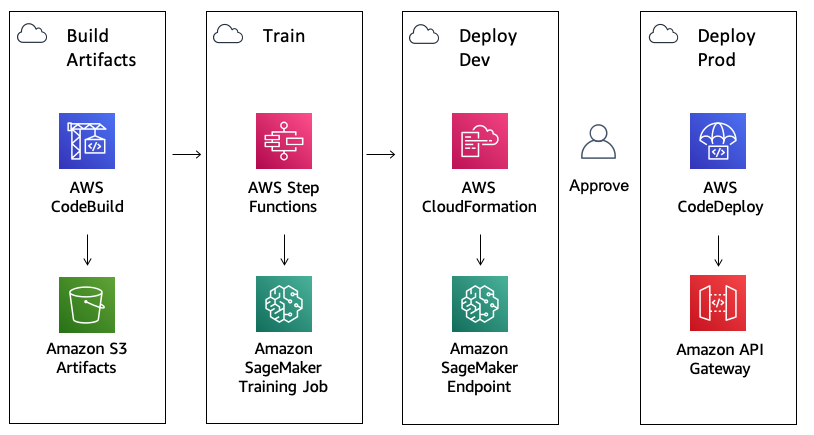
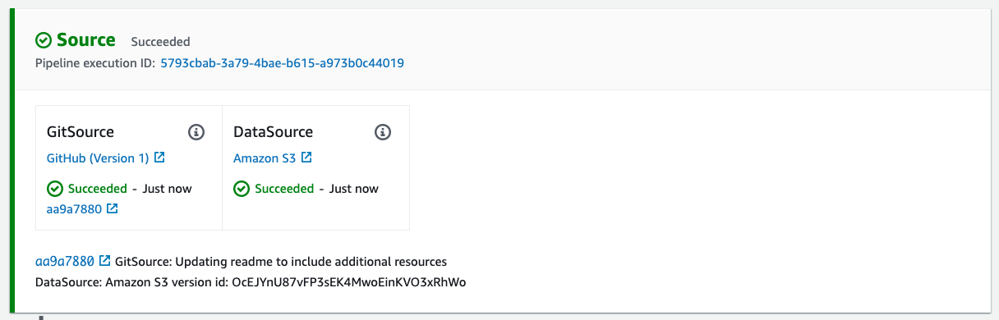

# Amazon SageMaker Safe Deployment Pipeline
## Introduction

This is a sample solution to build a safe deployment pipeline for Amazon SageMaker. This example could be useful for any organization looking to operationalize machine learning with native AWS development tools such as AWS CodePipeline, AWS CodeBuild and AWS CodeDeploy.

This solution provides a *Blue/Green*, also known as an *Canary deployment*, by creating an AWS Lambda API that calls into an Amazon SageMaker Endpoint for real-time inference.

##  Architecture

In the following diagram, you can view the continuous delivery stages of AWS CodePipeline.

1. Build Artifacts: Runs an AWS CodeBuild job to create AWS CloudFormation templates.
2. Train: Trains an Amazon SageMaker pipeline and Baseline Processing Job
3. Deploy Dev: Deploys a development Amazon SageMaker Endpoint
4. Deploy Prod: Deploys an Amazon API Gateway endpoint, and AWS Lambda function in front of Amazon SageMaker Endpoints using AWS CodeDeploy for blue/green deployment and rollback.



###  Components Details

  - [**AWS CodePipeline**](https://aws.amazon.com/codepipeline/) – CodePipeline has various stages defined in CloudFormation, which step through which actions must be taken in which order to go from source code to creation of the production endpoint.
  - [**AWS CodeBuild**](https://aws.amazon.com/codebuild/) – This solution uses AWS CodeBuild to build the source code from GitHub.
  - [**Amazon S3**](https://aws.amazon.com/s3/) – Artifacts created throughout the pipeline as well as the data for the model is stored in an Simple Storage Service (S3) Bucket.
  - [**AWS CloudFormation**](https://aws.amazon.com/cloudformation/) – This solution uses the AWS CloudFormation Template language, in either YAML or JSON, to create each resource including a custom resource.
  - [**AWS Step Functions**](https://aws.amazon.com/step-functions/) – This solutions creates AWS StepFunctions to orchestrate Amazon SageMaker training and processing jobs.
  - [**Amazon SageMaker**](https://aws.amazon.com/sagemaker/) – This solution uses Amazon SageMaker to train and deploy the machine learning model.
  - [**AWS CodeDeploy**](https://aws.amazon.com/codedeploy/) – This solution uses AWS CodeDeploy to automate shifting traffic between two AWS Lambda functions.
  - [**Amazon API Gateway**](https://aws.amazon.com/api-gateway/) – This solutions creates an HTTPS REST API endpoint for AWS Lambda functions that invoke deployed Amazon SageMaker Endpoint.

## Deployment Steps

The following is the list of steps required to get up and running with this sample.

###  Requirements

* Create your AWS account at [http://aws.amazon.com](http://aws.amazon.com) by following the instructions on the site.
* A Studio user account, see [onboard to Amazon SageMaker Studio](https://docs.aws.amazon.com/sagemaker/latest/dg/gs-studio-onboard.html)
###  Enable Amazon SageMaker Studio Project

1. From AWS console navigate to Amazon SageMaker Studio and click on your studio user name (do **not** Open Studio now) and copy the name of execution role as shown below (similar to `AmazonSageMaker-ExecutionRole-20210112T085906`)

<p align="center">
  
</p>

2. Click on the launch button below to setup the stack

<p align="center">
  <a href="https://us-east-1.console.aws.amazon.com/cloudformation/home?region=us-east-1#/stacks/quickcreate?templateUrl=https%3A%2F%2Famazon-sagemaker-safe-deployment-pipeline.s3.amazonaws.com%2Fstudio.yml&stackName=mlops-studio&param_PipelineBucket=amazon-sagemaker-safe-deployment-pipeline"></a>
</p>

and paste the role name copied in step 1 as the value of the parameter `SageMakerStudioRoleName` as shown below and click **Create Stack**

<p align="center">
  
</p>

*Alternatively*, one can use the provided `scripts/build.sh` (which required [AWS CLI](https://docs.aws.amazon.com/cli/latest/userguide/install-cliv2.html) installed with appropriate IAM permissions) as follows
```
# bash scripts/build.sh S3_BUCKET_NAME STACK_NAME REGION STUDIO_ROLE_NAME
# REGION should match your default AWS CLI region
# STUDIO_ROLE_NAME is copied from step 1. Example:
bash scripts/build.sh example-studio example-pipeline us-east-1 AmazonSageMaker-ExecutionRole-20210112T085906
```

3. From the AWS console navigate to `cloudformation` and once the stack `STACK_NAME` is ready
4. Go to your SageMaker Studio and **Open Studio** (and possibly refresh your browser if you're already in Studio) and from the your left hand side panel, click on the inverted triangle. As with the screenshot below, under `Projects -> Create project -> Organization templates`, you should be able to see the added **SageMaker Safe Deployment Pipeline**. Click on the template name and **Select project template**

<p align="center">
  
</p>

5. Choose a name for the project and can leave the rest of the fields with their default values (can use your own email for SNS notifications) and click on **Create project**
6. Once the project is created, it gives you the option to clone it locally from AWS CodeCommit by a single click. Click clone and it goes directly to the project
7. Navigate to the code base and go to `notebook/mlops.ipynb`
8.  Choose a kernel from the prompt such as `Python 3 (Data Science)`
9.  Assign your project name to the placeholder `PROJECT_NAME` in the first code cell of the `mlops.ipynb` notebook
10.  Now you are ready to go through the rest of the cells in `notebook/mlops.ipynb`


###  Start, Test and Approve the Deployment

Once the deployment is complete, there will be a new AWS CodePipeline created, with a Source stage that is linked to your source code repository. You will notice initially that it will be in a *Failed* state as it is waiting on an S3 data source.


Once the notebook is running, you will be guided through a series of steps starting with downloading the  [New York City Taxi](https://registry.opendata.aws/nyc-tlc-trip-records-pds/) dataset, uploading this to an Amazon SageMaker S3 bucket along with the data source meta data to trigger a new build in the AWS CodePipeline.



Once your pipeline is kicked off it will run model training and deploy a development SageMaker Endpoint.

There is a manual approval step which you can action directly within the SageMaker Notebook to promote this to production, send some traffic to the live endpoint and create a REST API.


Subsequent deployments of the pipeline will use AWS CodeDeploy to perform a blue/green deployment to shift traffic from the Original to Replacement endpoint over a period of 5 minutes.


Finally, the SageMaker Notebook provides the ability to retrieve the results from the Monitoring Schedule that is run on the hour.

###  Approximate Times:

The following is a list of approximate running times for the pipeline:

* Full Pipeline: 35 minutes
* Start Build: 2 minutes
* Model Training and Baseline: 5 minutes
* Launch Dev Endpoint: 10 minutes
* Launch Prod Endpoint: 15 minutes
* Monitoring Schedule: runs on the hour

## Customizing for your own model

This project is written in Python, and design to be customized for your own model and API.

```
.
├── api
│   ├── __init__.py
│   ├── app.py
│   ├── post_traffic_hook.py
│   └── pre_traffic_hook.py
├── assets
│   ├── deploy-model-dev.yml
│   ├── deploy-model-prod.yml
│   ├── suggest-baseline.yml
│   └── training-job.yml
├── custom_resource
|   ├── __init__.py
|   ├── sagemaker_monitoring_schedule.py
|   ├── sagemaker_suggest_baseline.py
|   ├── sagemaker_training_job.py
│   └── sagemaker-custom-resource.yml
├── model
│   ├── buildspec.yml
│   ├── dashboard.json
│   ├── requirements.txt
│   └── run_pipeline.py
├── notebook
│   ├── dashboard.json
|   ├── workflow.ipynb
│   └── mlops.ipynb
├── scripts
|   ├── build.sh
|   ├── lint.sh
|   └── set_kernelspec.py
├── pipeline.yml
└── studio.yml
```

Edit the `get_training_params` method in the `model/run_pipeline.py` script that is run as part of the AWS CodeBuild step to add your own estimator or model definition.

Extend the AWS Lambda hooks in `api/pre_traffic_hook.py` and `api/post_traffic_hook.py` to add your own validation or inference against the deployed Amazon SageMaker endpoints. You can also edit the `api/app.py` lambda to add any enrichment or transformation to the request/response payload.

## Running Costs

This section outlines cost considerations for running the SageMaker Safe Deployment Pipeline. Completing the pipeline will deploy development and production SageMaker endpoints which will cost less than $10 per day. Further cost breakdowns are below.

- **CodeBuild** – Charges per minute used. First 100 minutes each month come at no charge. For information on pricing beyond the first 100 minutes, see [AWS CodeBuild Pricing](https://aws.amazon.com/codebuild/pricing/).
- **CodeCommit** – $1/month if you didn't opt to use your own GitHub repository.
- **CodeDeploy** – No cost with AWS Lambda.
- **CodePipeline** – CodePipeline costs $1 per active pipeline* per month. Pipelines are free for the first 30 days after creation. More can be found at [AWS CodePipeline Pricing](https://aws.amazon.com/codepipeline/pricing/).
- **CloudWatch** - This template includes 1 dashboard and 3 alarms (2 for deployment and 1 for model drift) which costs less than $10 per month.
  - Dashboards cost $3/month.
  - Alarm metrics cost $0.10 per alarm.
- **CloudTrail** - Low cost, $0.10 per 100,000 data events to enable [S3 CloudWatch Event](https://docs.aws.amazon.com/codepipeline/latest/userguide/create-cloudtrail-S3-source-console.html).  For more information, see [AWS CloudTrail Pricing](https://aws.amazon.com/cloudtrail/pricing/)
- **KMS** – $1/month for the [Customer Managed CMK](https://docs.aws.amazon.com/kms/latest/developerguide/concepts.html#customer-cmk) created.
- **API Gateway** - Low cost, $1.29 for first 300 million requests.  For more info see [Amazon API Gateway pricing](https://aws.amazon.com/api-gateway/pricing/)
- **Lambda** - Low cost, $0.20 per 1 million request see [AWS Lambda Pricing](https://aws.amazon.com/lambda/pricing/).
- **SageMaker** – Prices vary based on EC2 instance usage for the Notebook Instances, Model Hosting, Model Training and Model Monitoring; each charged per hour of use. For more information, see [Amazon SageMaker Pricing](https://aws.amazon.com/sagemaker/pricing/).
  - The `ml.t3.medium` instance *notebook* costs $0.0582 an hour.
  - The `ml.m4.xlarge` instance for the *training* job costs $0.28 an hour.
  - The `ml.m5.xlarge` instance for the *monitoring* baseline costs $0.269 an hour.
  - The `ml.t2.medium` instance for the dev *hosting* endpoint costs $0.065 an hour.
  - The two `ml.m5.large` instances for production *hosting* endpoint costs 2 x $0.134 per hour.
  - The `ml.m5.xlarge` instance for the hourly scheduled *monitoring* job costs $0.269 an hour.
- **S3** – Prices will vary depending on the size of the model/artifacts stored. The first 50 TB each month will cost only $0.023 per GB stored. For more information, see [Amazon S3 Pricing](https://aws.amazon.com/s3/pricing/).

## Cleaning Up

First, delete the stacks used as part of the pipeline for deployment, training job and suggest baseline. For a model name of **nyctaxi** that would be:

* *nyctaxi*-deploy-prd
* *nyctaxi*-deploy-dev
* *nyctaxi*-workflow
* sagemaker-custom-resource

Finally, delete the stack you created in AWS CloudFormation.

## Security

See [CONTRIBUTING](CONTRIBUTING.md#security-issue-notifications) for more information.

## License

This library is licensed under the MIT-0 License. See the LICENSE file.
